```mermaid
flowchart TB
    %% ================= GLOBAL STYLES =================
    classDef routerStyle fill:#1e1b4b,stroke:#818cf8,stroke-width:2px,color:#f8fafc,rx:8,ry:8;
    classDef publicView fill:#082f49,stroke:#38bdf8,stroke-width:2px,color:#f8fafc,rx:8,ry:8;
    classDef authView fill:#2e1065,stroke:#c084fc,stroke-width:2px,color:#f8fafc,rx:8,ry:8;
    classDef adminView fill:#14532d,stroke:#4ade80,stroke-width:2px,color:#f8fafc,rx:8,ry:8;
    classDef pricingView fill:#701a75,stroke:#f472b6,stroke-width:2px,color:#f8fafc,rx:8,ry:8;
    classDef serviceStyle fill:#1e293b,stroke:#94a3b8,stroke-width:2px,color:#f8fafc,rx:8,ry:8;
    classDef interceptorStyle fill:#312e81,stroke:#a5b4fc,stroke-width:2px,color:#f8fafc,rx:8,ry:8;
    classDef backendStyle fill:#022c22,stroke:#2dd4bf,stroke-width:2px,color:#f8fafc,rx:8,ry:8;
    classDef mlStyle fill:#451a03,stroke:#fbbf24,stroke-width:2px,color:#f8fafc,rx:8,ry:8;

    %% ================= CLIENT RUNTIME =================
    subgraph ClientBrowser [" 🖥️ CLIENT RUNTIME ENVIRONMENT (Angular 19 SPA :4200) "]

        subgraph NavigationTier [" 🚦 Standalone Routing & Guard Perimeter "]
            Router["Angular 19 Router<br/><i>(Lazy-Loaded Component Routes)</i>"]:::routerStyle
            Guards{{"Functional & Class Route Guards<br/><i>(LoginGuard / AdminGuard)</i>"}}:::routerStyle
        end

        subgraph ComponentLayers [" 🎨 Standalone UI Component Feature Modules "]
            PublicViews["Customer Booking & Catalog Hub<br/><i>(Car List Split-Layout, Car Detail, Leaflet Map)</i>"]:::publicView
            AuthViews["Identity & Registration Portal<br/><i>(Individual & Corporate Login/Register)</i>"]:::authView
            AdminViews["Fleet & Organization Management<br/><i>(Car, Brand, Color CRUD & Location Managers)</i>"]:::adminView
            PricingViews["RL Dynamic Pricing Dashboard<br/><i>(Recommendations, Batch Updates, Reward Loops)</i>"]:::pricingView
        end

        subgraph CoreServicesTier [" 🧠 Injectable Services & State Providers "]
            AuthService["AuthService<br/><i>(@auth0/angular-jwt Token & Claims)</i>"]:::serviceStyle
            DomainServices["Domain HTTP Services<br/><i>(CarService, RentalService, PricingService, LocationService)</i>"]:::serviceStyle
            Interceptor[["AuthInterceptor<br/><i>(Bearer Token Injection & Header Normalization)</i>"]]:::interceptorStyle
        end
    end

    %% ================= BACKEND & ML APIS =================
    subgraph BackendAPI [" 🛡️ .NET 7 BACKEND GATEWAY (:44306) "]
        DotNetAPI[("ASP.NET Core Web API<br/><code>https://localhost:44306/api/*</code><br/><i>(AOP Interceptors, EF Core, SQL Server)</i>")]:::backendStyle
    end

    subgraph MLMicroservice [" 🤖 INTERNAL REINFORCEMENT LEARNING ENGINE "]
        PythonRL["Python FastAPI RL Pricing Service<br/><code>http://127.0.0.1:8001 (Internal Only)</code><br/><i>(Q-Learning Agent & Price Multiplier)</i>"]:::mlStyle
    end

    %% ================= PIPELINE CONNECTIONS =================
    Router ==> Guards
    Guards ==> ComponentLayers

    ComponentLayers -->|"Access Identity & Claims"| AuthService
    ComponentLayers ==>|"Invoke Data Methods"| DomainServices
    DomainServices ==> Interceptor
    Interceptor ==>|"HTTPS / JSON + Bearer Authorization"| DotNetAPI
    DotNetAPI <-.->|"Secure Reverse Proxy (Batch Payload)"| PythonRL
```

# rentacar — Angular 19 Enterprise Car Rental Platform & RL Pricing Dashboard

<div align="center">


**A modern, standalone-component-driven Single Page Application (SPA) featuring multi-criteria fleet filtering, interactive Leaflet branch locator, and an algorithmic Reinforcement Learning Dynamic Pricing Dashboard.**

[Live Client (Local)](#getting-started--local-setup) • [Architecture Guide](#system-architecture--system-flow) • [Pricing Dashboard](#4-reinforcement-learning-dynamic-pricing-dashboard) • [Backend API Service](https://github.com/kamiltuncok/CarProject)

</div>

---

> ### 📋 GitHub Repository Metadata
> * **Description:** Modern Angular 19 car rental SPA featuring standalone components, Leaflet branch mapping, JWT guards, and an RL dynamic pricing dashboard.
> * **Topics:** `angular-19`, `typescript`, `standalone-components`, `leaflet`, `dynamic-pricing`, `reinforcement-learning`, `car-rental`, `bootstrap-5`, `jwt-auth`, `rxjs`

---

## 📖 Executive Summary & Core Value

`rentacar` is an enterprise vehicle rental frontend client engineered with **Angular 19** standalone components. It provides role-tailored portals for individual customers, corporate organizations, branch managers, and system administrators:
* **Customer Hub:** Multi-attribute real-time catalog search (by Brand, Color, Segment, Fuel, Transmission, and Branch), split-view vehicle specifications, interactive Leaflet branch office locator, and checkout reservation flow.
* **Corporate & Administrative Portals:** Separate corporate onboarding, fleet CRUD operations, location manager assignments, and operational permissions.
* **RL Dynamic Pricing Dashboard:** Administrative monitoring and execution center for an algorithmic Q-learning pricing engine, featuring single-car recommendations, fleet-wide batch repricing, reward loop settlement, and A/B revenue/utilization metrics.

---

## 🎯 Evaluator Guide: Key Architectural Highlights

If you are an evaluator or technical recruiter reviewing code quality, here are the best starting points:

| Evaluated Concept | Key Implementation Files | Key Takeaway |
|---|---|---|
| **Standalone Component Architecture** | `src/app/components/` & `app.routes.ts` | Zero `NgModule` boilerplate; lazy-loaded standalone components via `loadComponent` route imports. |
| **RL Dynamic Pricing Dashboard** | `src/app/components/pricing-dashboard/` | Full-featured administrative control panel monitoring ML price decisions, batch executions, and A/B utilization metrics. |
| **Geospatial Mapping** | [`branches.component.ts`](file:///c:/Users/MONSTER/OneDrive/Belgeler/GitHub/rentacar/src/app/components/branches/branches.component.ts) | Lightweight, dependency-free interactive branch locator with **Leaflet** maps and custom markers. |
| **JWT Interception & Claims** | `src/app/interceptors/auth.interceptor.ts` | Transparent `Bearer` token injection and role/claim verification using `@auth0/angular-jwt`. |
| **Route Protection & Guards** | `src/app/guards/` (`login.guard.ts`, `admin.guard.ts`) | Functional and class-based route guards restricting administrative inventory and pricing views. |

---

## 🏛️ System Architecture & System Flow



---

## 🗂️ Project Structure & Directory Organization

```
rentacar/
├── src/
│   ├── app/
│   │   ├── components/            # Standalone UI Feature Modules (30+ components)
│   │   │   ├── branches/          # Leaflet interactive branch office map
│   │   │   ├── car/               # Vehicle grid, split-layout catalogue & zebra striping
│   │   │   ├── car-detail/        # Vehicle specs, daily rates, image gallery & booking
│   │   │   ├── car-search-form/   # Multi-criteria filter search widget
│   │   │   ├── payment/           # Checkout reservation flow & client credit card check
│   │   │   ├── pricing-dashboard/ # RL dynamic pricing administrative control center
│   │   │   ├── profile/           # User profile & rental history management
│   │   │   ├── login/ & register/ # Individual client authentication
│   │   │   ├── loginforcorporate/ # Corporate account authentication
│   │   │   └── *-add / *-update   # Inventory management forms (Brand, Car, Color, Location)
│   │   ├── guards/                # Route security guards (LoginGuard, AdminGuard)
│   │   ├── interceptors/          # AuthInterceptor (JWT Bearer token attachment)
│   │   ├── models/                # Strongly-typed TypeScript domain models & DTOs
│   │   │   ├── car.ts, rental.ts  # Vehicle & booking models
│   │   │   ├── pricing.ts         # PriceDecision, PricingPerformance interfaces
│   │   │   └── responseModel.ts   # Generic API response envelope contracts
│   │   ├── pipes/                 # Custom transformation pipes (FilterPipe, VatPipe)
│   │   ├── services/              # Injectable HTTP services (CarService, PricingService, etc.)
│   │   ├── app.config.ts          # Application providers, animations & HTTP interceptors
│   │   └── app.routes.ts          # Standalone route table with lazy loading
│   ├── assets/                    # Static images, icons, and hero car artwork
│   ├── styles.css                 # Global CSS design tokens, zebra striping & variables
│   └── main.ts                    # Angular bootstrap entry point
├── angular.json                   # Angular workspace build configuration
├── package.json                   # Dependencies and npm scripts
└── tsconfig.json                  # TypeScript compiler options
```

---

## ⚡ Key Features & UI Portals

### 1. Customer Booking & Fleet Catalog
* **Multi-Attribute Filter Widget:** Instant filtering across Brands, Colors, Fuel Types (Gasoline, Diesel, Hybrid, Electric), Transmissions (Manual, Automatic), and Rental Branches.
* **Conversion-Focused Split Layout:** Vehicle catalogue featuring side-by-side specification overview, daily rate badges, and quick reservation triggers.
* **Interactive Branch Map (Leaflet):** Real geographic branch location map with interactive popups and office operating details.

### 2. Role-Based Identity & Security Portals
* **Discrete Auth Workflows:** Tailored login/registration flows for Individual users and Corporate accounts.
* **JWT Claim Decoding:** Seamless extraction of user identity and administrative operation claims via `@auth0/angular-jwt`.
* **Guard Protection:** `AdminGuard` protects inventory management and dynamic pricing screens from unauthorized access.

### 3. Reinforcement Learning Dynamic Pricing Dashboard
* **Algorithm-Driven Recommendations:** Visualizes suggested daily rates computed by the Q-learning agent.
* **Fleet Batch Execution:** Execute instant price adjustments across the entire vehicle fleet in a single batch.
* **Reward Loop Settlement:** Administrative tools to close completed rental observation windows and feed reward metrics back to the RL engine.
* **A/B Performance Analytics:** Comparative analysis of revenue and fleet utilization between RL-managed cars and static baseline control groups over 7, 30, and 90-day intervals.

---

## 🛠️ Technology Stack

| Domain | Technology |
|---|---|
| **Framework & Core** | Angular 19.2, TypeScript 5.8, RxJS 7.8, Zone.js 0.15 |
| **UI & Layout** | Bootstrap 5.2, ngx-bootstrap 11, Vanilla CSS Design System |
| **Geospatial & Mapping** | Leaflet 1.9, `@types/leaflet` |
| **Security & Auth** | `@auth0/angular-jwt`, Custom HTTP Interceptors, Route Guards |
| **Feedback & UX** | ngx-toastr 16, Angular Animations |
| **Build & Tooling** | Angular CLI 19, `@angular-devkit/build-angular` |

---

## 🚀 Getting Started & Local Setup

### Prerequisites
* **Node.js:** v18.x or v20.x+
* **Angular CLI:** Version 19+ (`npm install -g @angular/cli`)
* **Backend Service:** [CarProject Backend](https://github.com/kamiltuncok/CarProject) running on `https://localhost:44306`

### 1. Installation
```bash
# Clone the repository
git clone https://github.com/kamiltuncok/rentacar.git
cd rentacar

# Install dependencies
npm install
```

### 2. Start Development Server
```bash
npm start
# or: ng serve
```
Navigate to **`http://localhost:4200/`** in your browser. The application will automatically reload upon file changes.

### 3. Production Build
```bash
npm run build
```
Optimized, AOT-compiled production artifacts will be created in the `dist/` directory.

---

## 🔗 Key API Integration Endpoints

The frontend communicates with the backend via `https://localhost:44306/api/`:

| Service | Endpoint Path | Description |
|---|---|---|
| `AuthService` | `/api/auth/login`, `/api/auth/register` | Authentication and JWT issuance |
| `CarService` | `/api/cars/getcardetails` | Fleet catalogue and composite vehicle data |
| `RentalService` | `/api/rentals/add` | Booking validation and rental creation |
| `LocationService` | `/api/locations/getall` | Branch coordinates for Leaflet maps |
| `PricingService` | `/api/cars/{id}/recommended-price` | Single-vehicle pricing recommendations |
| `PricingService` | `/api/cars/update-prices-batch` | Fleet-wide dynamic batch repricing |
| `PricingService` | `/api/cars/settle-rewards` | Closes completed rental reward periods |
| `PricingService` | `/api/cars/pricing/performance` | RL vs control group performance metrics |
