# rentacar — Angular Enterprise Car Rental Platform & RL Pricing Dashboard

A modern, standalone-component-driven Single Page Application (SPA) built with **Angular 19** and **TypeScript** for an enterprise vehicle rental platform. It provides role-based portals for individual customers, corporate clients, location managers, and system administrators. The application features multi-criteria fleet filtering, interactive branch mapping with Leaflet, secure JWT authentication flows, mock checkout processing, and a dedicated **Reinforcement Learning Dynamic Pricing Dashboard**.

This repository is the **frontend SPA**. The underlying ASP.NET Core backend API is located in [CarProject](https://github.com/kamiltuncok/CarProject).

---

## Recruiter & Engineering Summary

- **Primary Stack**: Angular 19 (Standalone Components), TypeScript 5.8, RxJS 7.8, Bootstrap 5.2, ngx-toastr, Leaflet Maps, `@auth0/angular-jwt`.
- **Key Engineering Highlights**: Fully modular standalone component architecture with route-level lazy loading (`loadComponent`), functional and class-based route guards (`LoginGuard`, `AdminGuard`), HTTP interceptors for automatic JWT Bearer token attachment, reactive and template-driven forms with custom validation, and interactive geographic office mapping.
- **Primary Technical Challenge**: Providing a unified administrative dashboard that monitors and triggers algorithmic reinforcement learning price adjustments and settles pricing reward loops across multi-segment vehicle fleets, all routed securely through a .NET backend proxy without exposing internal microservices.

---

## Architecture & System Flow

```mermaid
flowchart TB
    %% ================= GLOBAL STYLES =================
    classDef routerStyle fill:#1e1b4b,stroke:#818cf8,stroke-width:2px,color:#f8fafc,rx:8,ry:8;
    classDef publicView fill:#082f49,stroke:#38bdf8,stroke-width:2px,color:#f8fafc,rx:8,ry:8;
    classDef authView fill:#2e1065,stroke:#c084fc,stroke-width:2px,color:#f8fafc,rx:8,ry:8;
    classDef adminView fill:#14532d,stroke:#4ade80,stroke-width:2px,color:#f8fafc,rx:8,ry:8;
    classDef pricingView fill:#701a75,stroke:#f472b6,stroke-width:2px,color:#f8fafc,rx:8,ry:8;
    classDef serviceStyle fill:#1e293b,stroke:#94a3b8,stroke-width:2px,color:#f8fafc,rx:8,ry:8;
    classDef interceptorStyle fill:#312e81,stroke:#a5b4fc,stroke-width:2px,color:#f8fafc,rx:8,ry:8;
    classDef backendStyle fill:#022c22,stroke:#2dd4bf,stroke-width:2px,color:#f8fafc,rx:8,ry:8;
    classDef mlStyle fill:#451a03,stroke:#fbbf24,stroke-width:2px,color:#f8fafc,rx:8,ry:8;

    %% ================= CLIENT RUNTIME =================
    subgraph ClientBrowser [" 🖥️ CLIENT RUNTIME ENVIRONMENT (Angular 19 SPA :4200) "]

        subgraph NavigationTier [" 🚦 Standalone Routing & Guard Perimeter "]
            Router["Angular 19 Router<br/><i>(Lazy-Loaded Component Routes)</i>"]:::routerStyle
            Guards{{"Functional & Class Route Guards<br/><i>(LoginGuard / AdminGuard)</i>"}}:::routerStyle
        end

        subgraph ComponentLayers [" 🎨 Standalone UI Component Feature Modules "]
            PublicViews["Customer Booking & Catalog Hub<br/><i>(Car List Split-Layout, Car Detail, Leaflet Map)</i>"]:::publicView
            AuthViews["Identity & Registration Portal<br/><i>(Individual & Corporate Login/Register)</i>"]:::authView
            AdminViews["Fleet & Organization Management<br/><i>(Car, Brand, Color CRUD & Location Managers)</i>"]:::adminView
            PricingViews["RL Dynamic Pricing Dashboard<br/><i>(Recommendations, Batch Updates, Reward Loops)</i>"]:::pricingView
        end

        subgraph CoreServicesTier [" 🧠 Injectable Services & State Providers "]
            AuthService["AuthService<br/><i>(@auth0/angular-jwt Token & Claims)</i>"]:::serviceStyle
            DomainServices["Domain HTTP Services<br/><i>(CarService, RentalService, PricingService, LocationService)</i>"]:::serviceStyle
            Interceptor[["AuthInterceptor<br/><i>(Bearer Token Injection & Header Normalization)</i>"]]:::interceptorStyle
        end
    end

    %% ================= BACKEND & ML APIS =================
    subgraph BackendAPI [" 🛡️ .NET 7 BACKEND GATEWAY (:44306) "]
        DotNetAPI[("ASP.NET Core Web API<br/><code>https://localhost:44306/api/*</code><br/><i>(AOP Interceptors, EF Core, SQL Server)</i>")]:::backendStyle
    end

    subgraph MLMicroservice [" 🤖 INTERNAL REINFORCEMENT LEARNING ENGINE "]
        PythonRL["Python FastAPI RL Pricing Service<br/><code>http://127.0.0.1:8001 (Internal Only)</code><br/><i>(Q-Learning Agent & Price Multiplier)</i>"]:::mlStyle
    end

    %% ================= PIPELINE CONNECTIONS =================
    Router ==> Guards
    Guards ==> ComponentLayers

    ComponentLayers -->|"Access Identity & Claims"| AuthService
    ComponentLayers ==>|"Invoke Data Methods"| DomainServices
    DomainServices ==> Interceptor
    Interceptor ==>|"HTTPS / JSON + Bearer Authorization"| DotNetAPI
    DotNetAPI <-.->|"Secure Reverse Proxy (Batch Payload)"| PythonRL
```



---

## Key Features

### 1. Customer Booking & Search Flow
- **Multi-Attribute Search & Filter**: Real-time filtering by Brand, Color, Fuel Type (Gasoline, Diesel, Hybrid, Electric), Gear Type (Manual, Automatic), Vehicle Segment (Economy, Comfort, Luxury), and Branch Location.
- **Interactive Branch Locator**: Integrated **Leaflet** map displaying real branch coordinates across cities with interactive popups and office details.
- **Vehicle Details & Image Carousel**: Image viewer with fallbacks for missing media, technical specifications, daily rate display, and availability verification.
- **Checkout & Rental Management**: Date-range calculation, client-side credit card validation, and structured rental reservation submission.

### 2. Role-Based Portals & Authentication
- **Dual Registration & Login**: Separate registration and authentication workflows for Individual and Corporate accounts.
- **JWT State & Route Protection**: `@auth0/angular-jwt` decoding to extract user identities, claims, and role memberships.
- **Route Guards**: `LoginGuard` restricts checkout and user profile access; `AdminGuard` protects fleet inventory management and financial pricing views.
- **Session Persistence**: Token storage abstraction in `LocalStorageService` with automatic header attachment via `AuthInterceptor`.

### 3. Administrative Inventory & Branch Management
- Comprehensive CRUD interfaces for Cars, Brands, Colors, Car Images, and Physical Locations.
- Branch Manager assignment and operational role administration (`LocationManagerAddComponent`, `LocationManagerListComponent`).

### 4. Reinforcement Learning Dynamic Pricing Dashboard
- **Algorithmic Fleet Overview**: Visualizes recommended price adjustments calculated by the backend Q-learning reinforcement learning model.
- **Batch Execution**: Trigger single-vehicle or full-fleet batch price updates with instant feedback.
- **Reward Loop Settlement**: Provides administrative controls to settle reward feedback loops against completed rentals once observation windows expire.
- **A/B Performance Tracking**: Compares pricing metrics (revenue, utilization rate) between RL-optimized vehicles and static baseline control groups over 7, 30, or 90-day intervals.

---

## Technology Stack

| Category | Technologies |
|---|---|
| **Framework & Core** | Angular 19.2, TypeScript 5.8, RxJS 7.8, Zone.js 0.15 |
| **UI & Styling** | Bootstrap 5.2, ngx-bootstrap 11, Vanilla CSS Design System |
| **Mapping & Geospatial** | Leaflet 1.9, `@types/leaflet` |
| **Auth & Security** | `@auth0/angular-jwt`, Custom HTTP Interceptors, Route Guards |
| **Notifications & UX** | ngx-toastr 16, Angular Animations |
| **Build & Tooling** | Angular CLI 19, `@angular-devkit/build-angular` |

---

## Project Structure

```
rentacar/
├── src/
│   ├── app/
│   │   ├── components/            # Standalone UI components (32 feature modules)
│   │   │   ├── branches/          # Leaflet interactive branch office map
│   │   │   ├── car/               # Vehicle grid & catalogue
│   │   │   ├── car-detail/        # Vehicle specification, gallery & booking
│   │   │   ├── car-search-form/   # Multi-criteria filter search widget
│   │   │   ├── payment/           # Checkout flow & card validation
│   │   │   ├── pricing-dashboard/ # RL dynamic pricing admin panel
│   │   │   ├── profile/           # User account profile management
│   │   │   ├── login/ & register/ # Individual auth forms
│   │   │   ├── loginforcorporate/ # Corporate client auth forms
│   │   │   └── *-add / *-update   # Entity management forms (Brand, Car, Color, Location)
│   │   ├── guards/                # Route guards (LoginGuard, AdminGuard)
│   │   ├── interceptors/          # AuthInterceptor (JWT Bearer injection)
│   │   ├── models/                # Strongly-typed TypeScript interfaces & DTOs
│   │   │   ├── car.ts, rental.ts  # Domain models
│   │   │   ├── pricing.ts         # PricingDecision, PricingPerformance interfaces
│   │   │   └── responseModel.ts   # Generic API response contracts
│   │   ├── pipes/                 # Custom pipes (FilterPipe, VatPipe)
│   │   ├── services/              # Injectable HTTP services (CarService, PricingService, etc.)
│   │   ├── app.config.ts          # Application providers, HTTP client & animation setup
│   │   └── app.routes.ts          # Lazy-loaded route table with guard protections
│   ├── assets/                    # Static assets, fallback vehicle graphics
│   ├── styles.css                 # Global design system variables & utility styles
│   └── main.ts                    # Application bootstrap entry point
├── angular.json                   # Angular workspace configuration
├── package.json                   # Dependencies and npm scripts
└── tsconfig.json                  # TypeScript compiler options
```

---

## Key API Integration Points

The frontend communicates with the backend via `https://localhost:44306/api/`:

| Service | Endpoint Path | Purpose |
|---|---|---|
| `AuthService` | `/api/auth/login`, `/api/auth/register` | Authentication and JWT issuance |
| `CarService` | `/api/cars`, `/api/cars/getcardetails` | Fleet catalogue and composite vehicle data |
| `RentalService` | `/api/rentals/add`, `/api/rentals/checkrules` | Booking validation and rental creation |
| `LocationService` | `/api/locations/getall`, `/api/locationcities` | Branch coordinates for Leaflet maps |
| `PricingService` | `/api/cars/{id}/recommended-price` | Single-vehicle pricing recommendations |
| `PricingService` | `/api/cars/update-prices-batch` | Fleet-wide dynamic batch repricing |
| `PricingService` | `/api/cars/settle-rewards` | Closes completed rental reward periods |
| `PricingService` | `/api/cars/pricing/performance` | RL vs control group performance metrics |

---

## Getting Started

### Prerequisites

- [Node.js](https://nodejs.org/) (v18.x or v20.x recommended)
- [Angular CLI](https://angular.io/cli) (`npm install -g @angular/cli`)
- The [CarProject Backend](https://github.com/kamiltuncok/CarProject) running on `https://localhost:44306`

### 1. Installation

```bash
cd rentacar
npm install
```

### 2. Development Server

Run the local development server:

```bash
npm start
# or: ng serve
```

Navigate to `http://localhost:4200/` in your browser. The application automatically reloads on source file changes.

### 3. Production Build

```bash
npm run build
```

Compiled production artifacts will be generated in the `dist/` directory with bundle optimization and ahead-of-time (AOT) compilation.

---

## Engineering Decisions & Trade-offs

1. **Standalone Components over NgModules**:
   - The application leverages Angular standalone components (`standalone: true`) and `loadComponent` route imports to reduce bundle boilerplate and achieve granular code splitting.
2. **Backend Proxying of ML Services**:
   - The frontend never makes direct HTTP calls to the Python RL service (`http://127.0.0.1:8001`). All requests pass through `CarProject`'s `PricingService`. This keeps JWT authorization, CORS enforcement, and validation unified within the backend.
3. **Leaflet for Branch Visualizations**:
   - Lightweight, dependency-free mapping with Leaflet was selected over bulky proprietary map SDKs to maintain fast initial page load times while providing customizable map tiles and markers.

---

## Known Limitations & Roadmap

- **State Management**: Current state is managed via injectable RxJS services and `BehaviorSubject` instances; complex cross-component pricing workflows could benefit from NgRx or Signals state stores.
- **Automated Testing**: Unit tests for services and components using Jasmine/Karma are partially scaffolded and can be expanded.
- **Payment Gateway Integration**: Payment processing currently executes a client-side mock verification before recording the rental transaction in the backend.
